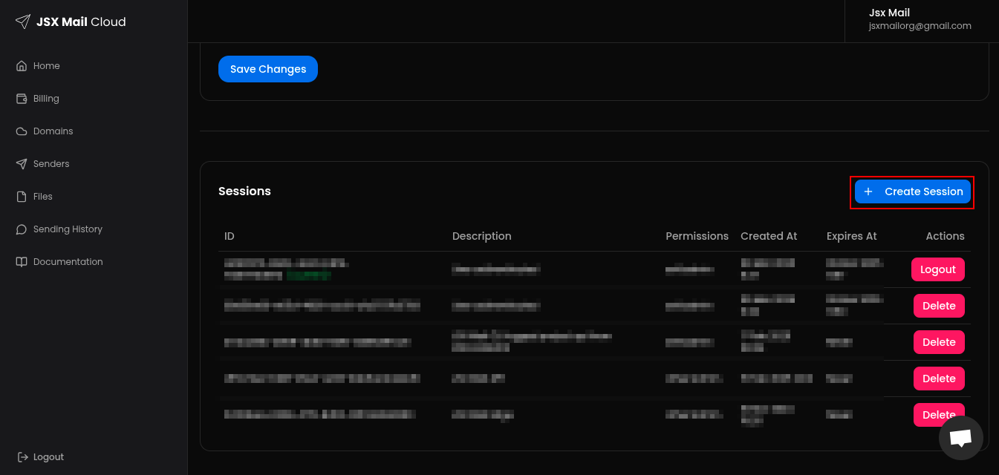
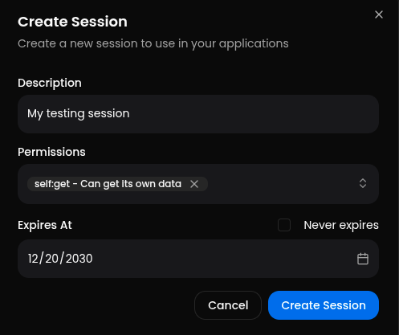

The API is authenticated using a bearer token. You can just pass the token in the header as `Authorization: Bearer <token>`.

## Creating a session

To get your token, you need to be logged in to the JSX Mail Cloud.

And then go to [your account page](https://cloud.jsxmail.org/app/account) and click into the create button:

After that just fill the form and create your session.

After the session is created, just copy the token and use it in the API.

<Note>This is the only moment you can see your generated token</Note>

## Using the token

To use the token, you just need to pass it in the header as `Authorization: Bearer <token>`.
